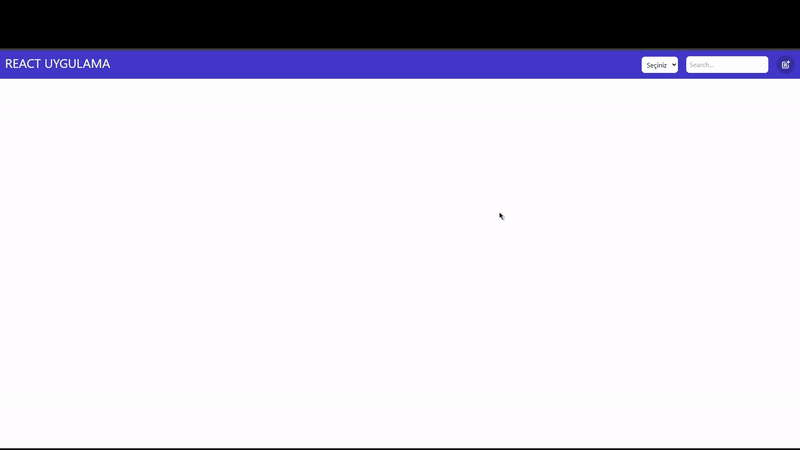

# Udemig React Redux Project

This project was creted by Yasin Özboğa.
This project was created with React.js, JavaScript, React-Redux and Tailwind technologies.
React-Redux was used for state management, Tailwind was used for style management.
Products filtering, product deleting, product editing and product adding were in this project for increase experience of the users.

## Used Libraries

```
react-router-dom react-icons react-redux redux tailwind
```

# Start the project

- `npm run dev`

## Preview


